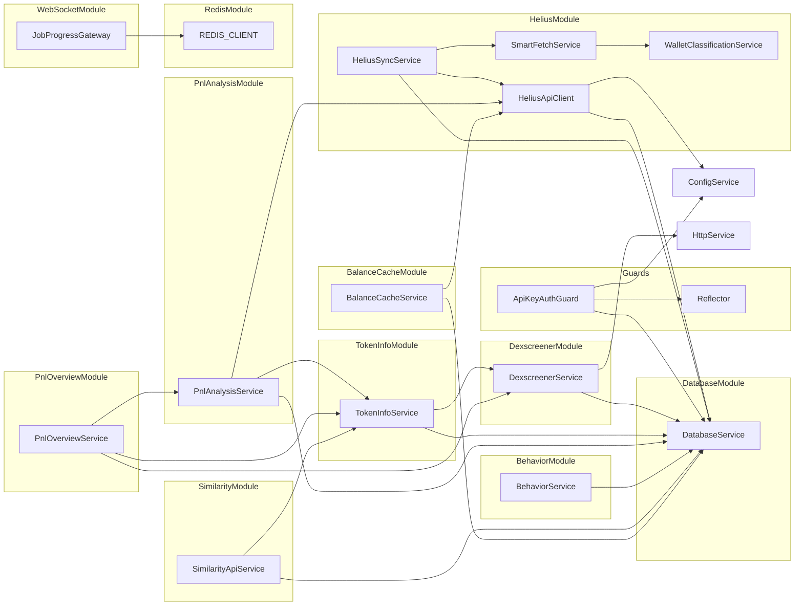
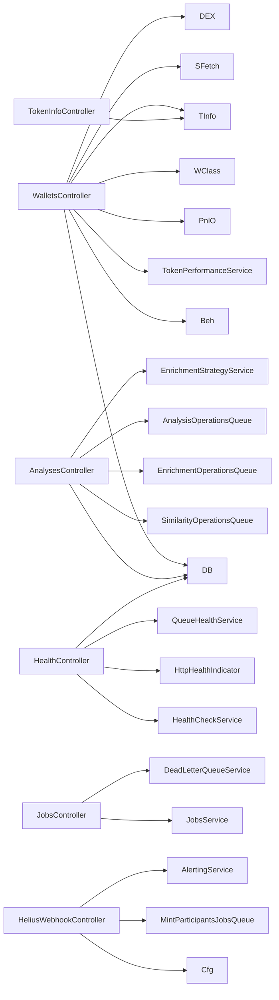
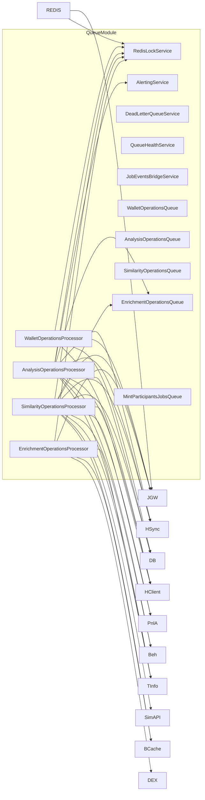

# Dependency Injection Map

This project uses NestJS modules and providers with the default singleton scope. Below is a concise map of modules, providers, factory tokens, and how dependencies are wired across the app.

## Overview

- App root: `src/app.module.ts` imports core feature and infrastructure modules and sets global guards.
- Config: `ConfigModule.forRoot({ isGlobal: true })` makes `ConfigService` available app‑wide.
- Global modules: `DatabaseModule`, `HeliusModule` export shared providers for use anywhere.
- Queues: `QueueModule` wires BullMQ queues, processors, Redis token, and monitoring services.

## Root Modules

- AppModule
  - imports: `ThrottlerModule`, `ConfigModule`, `DatabaseModule` (Global), `HeliusModule` (Global), `QueueModule`, `ApiModule`, `UsersModule`
  - providers (global guards): `APP_GUARD => ApiKeyAuthGuard`, `APP_GUARD => ThrottlerGuard`

- ApiModule
  - imports: `DatabaseModule`, `WalletsModule`, `AnalysesModule`, `UsersModule`, `DexscreenerModule`, `TokenInfoModule`, `HealthModule`, `JobsModule`, `WebSocketModule`, `QueueModule`, `HeliusIntegrationModule`
  - controllers: `TestController`

## Global Modules (shared singletons)

- DatabaseModule (`@Global`)
  - provides/exports: `DatabaseService` (extends core `DatabaseService` for Nest DI)

- HeliusModule (`@Global`)
  - imports: `ConfigModule`, `DatabaseModule`
  - factory providers:
    - `HeliusApiClient`: needs `ConfigService`, `DatabaseService`
    - `SmartFetchService`: needs `WalletClassificationService`
    - `HeliusSyncService`: needs `DatabaseService`, `HeliusApiClient`, `SmartFetchService`
  - class providers: `WalletClassificationService`
  - exports: `HeliusApiClient`, `HeliusSyncService`, `SmartFetchService`, `WalletClassificationService`

## Feature Modules

- UsersModule
  - imports: `DatabaseModule`
  - controllers: `UserFavoritesController`, `UsersController`
  - providers/exports: `UserFavoritesService`

- WalletsModule
  - imports: `DatabaseModule`, `PnlOverviewModule`, `BehaviorModule`, `TokenPerformanceModule`, `TokenInfoModule`, `DexscreenerModule`
  - controllers: `WalletsController`

- AnalysesModule
  - imports: `ConfigModule`, `DatabaseModule`, `PnlAnalysisModule`, `BehaviorModule`, `SimilarityModule`, `QueueModule`, `JobsModule`
  - controllers: `AnalysesController`
  - providers: `EnrichmentStrategyService`, `MintParticipantsService`

- TokenInfoModule
  - imports: `DatabaseModule`, `DexscreenerModule`
  - controllers: `TokenInfoController`
  - providers/exports: `TokenInfoService`

- DexscreenerModule
  - imports: `HttpModule`
  - providers/exports: `DexscreenerService`

- PnlAnalysisModule
  - imports: `DatabaseModule`, `HeliusModule`, `TokenInfoModule`
  - providers/exports: `PnlAnalysisService`

- PnlOverviewModule
  - imports: `DatabaseModule`, `TokenInfoModule`, `HeliusModule`, `DexscreenerModule`
  - providers: `PnlOverviewService`, `PnlAnalysisService`
  - exports: `PnlOverviewService`

- BehaviorModule
  - imports: `DatabaseModule`
  - providers/exports: `BehaviorService`

- SimilarityModule
  - imports: `DatabaseModule`, `HeliusModule`, `TokenInfoModule`, `DexscreenerModule`, `BalanceCacheModule`
  - providers/exports: `SimilarityApiService`

- BalanceCacheModule
  - imports: `DatabaseModule`, `TokenInfoModule`
  - providers/exports: `BalanceCacheService`

- HealthModule
  - imports: `TerminusModule`, `DatabaseModule`, `QueueModule`
  - controllers: `HealthController`

- HeliusIntegrationModule
  - imports: `ConfigModule`, `QueueModule`
  - controllers: `HeliusWebhookController`

- WebSocketModule
  - imports: `RedisModule`
  - providers/exports: `JobProgressGateway`

## Queue/Infra Modules

- RedisModule
  - provider token: `REDIS_CLIENT` (IoRedis client) via `redisProvider`
  - exports: `REDIS_CLIENT`

- QueueModule
  - imports: `ConfigModule`, `RedisModule`, `BullModule.forRootAsync(ConfigService)`, `BullModule.registerQueue(...)`, and feature modules providing services
  - queue services: `WalletOperationsQueue`, `AnalysisOperationsQueue`, `SimilarityOperationsQueue`, `EnrichmentOperationsQueue`, `MintParticipantsJobsQueue`
  - processors (Nest providers that own BullMQ Workers): `WalletOperationsProcessor`, `AnalysisOperationsProcessor`, `SimilarityOperationsProcessor`, `EnrichmentOperationsProcessor`
  - core queue services: `RedisLockService`, `AlertingService`, `DeadLetterQueueService`, `QueueHealthService`, `JobEventsBridgeService`
  - exports: queue services, core queue services, processors

## DI Tokens and Factories

- `REDIS_CLIENT`: IoRedis instance provided by `redisProvider`; injected into `RedisLockService`, `JobProgressGateway` (publisher), others via Nest `@Inject(REDIS_CLIENT)`.
- `HeliusApiClient`: created via factory using `ConfigService` (`HELIUS_API_KEY`) and `DatabaseService` in `HeliusModule`.
- `SmartFetchService`: factory depending on `WalletClassificationService` in `HeliusModule`.
- `HeliusSyncService`: factory depending on `DatabaseService`, `HeliusApiClient`, `SmartFetchService` in `HeliusModule`.

## Key Providers and Their Constructor Dependencies

- DatabaseService (Api)
  - extends core `DatabaseService`; no injected deps
  - provided by: `DatabaseModule`

- DexscreenerService
  - injects: `DatabaseService`, `HttpService`
  - provided by: `DexscreenerModule`
  - notes: wraps core `DexscreenerService` via manual instantiation

- TokenInfoService
  - injects: `DatabaseService`, `DexscreenerService`
  - provided by: `TokenInfoModule`

- PnlAnalysisService (Api wrapper)
  - injects: `DatabaseService`, `HeliusApiClient`, `TokenInfoService`
  - provided by: `PnlAnalysisModule`
  - notes: wraps core `PnlAnalysisService` via manual instantiation

- PnlOverviewService
  - injects: `PnlAnalysisService`, `TokenInfoService`, `DexscreenerService`
  - provided by: `PnlOverviewModule`

- BehaviorService (Api wrapper)
  - injects: `DatabaseService`
  - provided by: `BehaviorModule`
  - notes: instantiates core `BehaviorService` per call

- SimilarityApiService
  - injects: `DatabaseService`, `TokenInfoService`
  - provided by: `SimilarityModule`
  - notes: instantiates core `SimilarityService` per request

- BalanceCacheService
  - injects: `DatabaseService`, `HeliusApiClient`
  - provided by: `BalanceCacheModule`
  - notes: creates its own IoRedis client and core `WalletBalanceService`

- TokenPerformanceService
  - injects: `DatabaseService`, `TokenInfoService`, `DexscreenerService`
  - provided by: `TokenPerformanceModule`

- JobsService
  - injects: `WalletOperationsQueue`, `AnalysisOperationsQueue`, `SimilarityOperationsQueue`, `EnrichmentOperationsQueue`, `RedisLockService`, `DatabaseService`
  - provided by: `JobsModule`

- RedisLockService
  - injects: `REDIS_CLIENT`
  - provided by: `QueueModule`

- JobProgressGateway (WebSocket)
  - injects: `REDIS_CLIENT` (publisher); internally duplicates for a subscriber
  - provided by: `WebSocketModule`

- Processors (BullMQ Workers)
  - WalletOperationsProcessor: injects `RedisLockService`, `HeliusSyncService`, `DatabaseService`, `HeliusApiClient`
  - AnalysisOperationsProcessor: injects `RedisLockService`, `PnlAnalysisService`, `BehaviorService`, `DatabaseService`, `HeliusSyncService`, `EnrichmentOperationsQueue`, `HeliusApiClient`, `JobProgressGateway`, `TokenInfoService`, `AlertingService`
  - SimilarityOperationsProcessor: injects `RedisLockService`, `SimilarityApiService`, `DatabaseService`, `HeliusApiClient`, `TokenInfoService`, `HeliusSyncService`, `PnlAnalysisService`, `BehaviorService`, `EnrichmentOperationsQueue`, `BalanceCacheService`, `JobProgressGateway`
  - EnrichmentOperationsProcessor: injects `RedisLockService`, `TokenInfoService`, `DexscreenerService`, `BalanceCacheService`, `JobProgressGateway`

## Controllers and Injected Providers (high‑level)

- WalletsController
  - injects: `DatabaseService`, `BehaviorService`, `TokenPerformanceService`, `PnlOverviewService`, `TokenInfoService`, `WalletClassificationService`, `SmartFetchService`, `DexscreenerService`

- AnalysesController
  - injects: `DatabaseService`, `SimilarityOperationsQueue`, `EnrichmentOperationsQueue`, `AnalysisOperationsQueue`, `EnrichmentStrategyService`

- JobsController
  - injects: `JobsService`, `DeadLetterQueueService`

- TokenInfoController
  - injects: `TokenInfoService`

- HealthController
  - injects: `HealthCheckService`, `HttpHealthIndicator`, `DatabaseService`, `QueueHealthService`

- HeliusWebhookController
  - injects: `ConfigService`, `MintParticipantsJobsQueue`, `AlertingService`

## Guards and Pipes

- ApiKeyAuthGuard (global)
  - injects: `DatabaseService`, `Reflector`, `ConfigService`
  - registered as `APP_GUARD` in `AppModule`

- ThrottlerGuard (global)
  - registered as `APP_GUARD` in `AppModule`

- SolanaAddressPipe
  - `@Injectable()` pipe used in routes; no injected deps

## Notes on Manual Instantiation

- Several wrappers instantiate core services directly instead of having them as Nest providers:
  - `DexscreenerService` -> new core `DexscreenerService`
  - `PnlAnalysisService` -> new core `PnlAnalysisService`
  - `BehaviorService` -> new core `BehaviorService` per call
  - `SimilarityApiService` -> new core `SimilarityService` per request
  - `BalanceCacheService` -> new core `WalletBalanceService`
- Queue services (`*.queue.ts`) and processors (`*.processor.ts`) create `Queue`/`Worker` instances in constructors; they are still Nest providers but the BullMQ objects themselves are not via Nest DI.

## Lifetimes and Scope

- All providers listed are singletons by default (no `scope` specified).
- `ConfigModule` is global; `DatabaseModule` and `HeliusModule` are global and export their providers to all other modules.

---

This map is sourced from the current code under `src/`, including modules in `src/api/**` and queues in `src/queues/**`.

## Visual Diagrams (Mermaid)

Below are Mermaid graphs you can view directly on GitHub or in editors that support Mermaid.

### Module Imports

```mermaid
graph TD
  %% Root
  AppModule --> ConfigModule
  AppModule --> ThrottlerModule
  AppModule --> DatabaseModule
  AppModule --> HeliusModule
  AppModule --> QueueModule
  AppModule --> ApiModule
  AppModule --> UsersModule

  %% ApiModule imports
  ApiModule --> DatabaseModule
  ApiModule --> WalletsModule
  ApiModule --> AnalysesModule
  ApiModule --> UsersModule
  ApiModule --> DexscreenerModule
  ApiModule --> TokenInfoModule
  ApiModule --> HealthModule
  ApiModule --> JobsModule
  ApiModule --> WebSocketModule
  ApiModule --> QueueModule
  ApiModule --> HeliusIntegrationModule

  %% Wallets
  WalletsModule --> DatabaseModule
  WalletsModule --> PnlOverviewModule
  WalletsModule --> BehaviorModule
  WalletsModule --> TokenPerformanceModule
  WalletsModule --> TokenInfoModule
  WalletsModule --> DexscreenerModule

  %% Analyses
  AnalysesModule --> ConfigModule
  AnalysesModule --> DatabaseModule
  AnalysesModule --> PnlAnalysisModule
  AnalysesModule --> BehaviorModule
  AnalysesModule --> SimilarityModule
  AnalysesModule --> QueueModule
  AnalysesModule --> JobsModule

  %% PnL Overview
  PnlOverviewModule --> DatabaseModule
  PnlOverviewModule --> TokenInfoModule
  PnlOverviewModule --> HeliusModule
  PnlOverviewModule --> DexscreenerModule

  %% Similarity
  SimilarityModule --> DatabaseModule
  SimilarityModule --> HeliusModule
  SimilarityModule --> TokenInfoModule
  SimilarityModule --> DexscreenerModule
  SimilarityModule --> BalanceCacheModule

  %% Pnl Analysis
  PnlAnalysisModule --> DatabaseModule
  PnlAnalysisModule --> HeliusModule
  PnlAnalysisModule --> TokenInfoModule

  %% Token info
  TokenInfoModule --> DatabaseModule
  TokenInfoModule --> DexscreenerModule

  %% WebSocket / Queue Infra
  WebSocketModule --> RedisModule
  QueueModule --> ConfigModule
  QueueModule --> RedisModule
  QueueModule --> DatabaseModule
  QueueModule --> HeliusModule
  QueueModule --> SimilarityModule
  QueueModule --> BehaviorModule
  QueueModule --> PnlAnalysisModule
  QueueModule --> TokenInfoModule
  QueueModule --> DexscreenerModule
  QueueModule --> WebSocketModule
  QueueModule --> BalanceCacheModule
```

### Core Providers and Dependencies

### Controllers and Injected Services

### Queues, Processors, and Tokens

