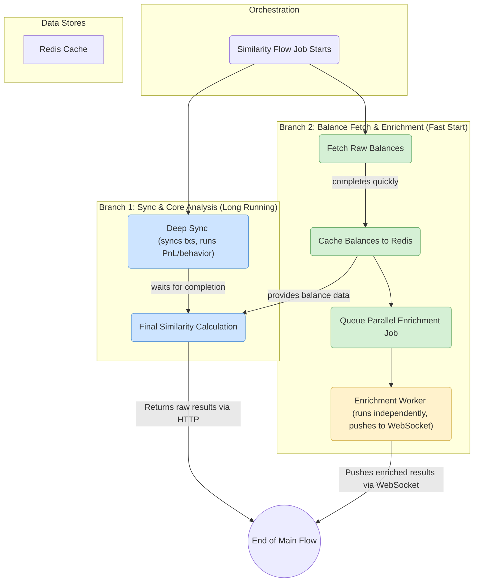

# Advanced Similarity Analysis Workflow

This document outlines the architecture and data flow of the "Advanced Similarity Analysis" feature, which is orchestrated by the `SimilarityOperationsProcessor`. The primary goal of this workflow is to deliver fast, actionable results to the user while progressively enhancing the data with richer metadata in the background.

## Architectural Principles

1.  **True Parallelism**: The workflow is designed to execute long-running I/O tasks (historical data sync) and short-running tasks (balance fetching and enrichment) concurrently, not sequentially. This ensures the expensive enrichment process begins as early as possible.
2.  **Progressive Enhancement**: The user interface first receives the core analysis results with raw, unenriched token data. It then listens for WebSocket events that provide the enriched data (prices, names, symbols), allowing the UI to update dynamically without blocking the user.
3.  **Self-Contained Orchestration**: The `SimilarityOperationsProcessor` acts as a "saga" or workflow manager for a given similarity request. It directly calls the necessary services in the correct order, avoiding a complex and brittle chain of dependent jobs across different queues.
4.  **Decoupling via Cache**: The two parallel branches of the workflow are decoupled. The Core Analysis branch and the Enrichment branch do not communicate directly. Instead, they share data through a Redis cache, where the raw balance data is stored and retrieved.

## Step-by-Step Execution Flow

The entire process is kicked off from the Similarity Lab UI and managed by a single `similarity-analysis-flow` job.

1.  **Initiation (Frontend -> API)**
    *   A user selects "Advanced Analysis" in the UI and submits a list of wallets.
    *   The frontend makes a POST request to the `/analyses/similarity/queue` endpoint.
    *   The `AnalysesController` receives the request, generates a unique `requestId`, and queues a `similarity-analysis-flow` job in the `similarity-operations` queue. It immediately returns the `jobId` and `requestId` to the client.

2.  **Orchestration (`SimilarityOperationsProcessor`)**
    *   The `SimilarityOperationsProcessor` picks up the `similarity-analysis-flow` job.
    *   It immediately kicks off two main branches of execution in parallel.

3.  **Branch A: Core Analysis Path (Long-Running Task)**
    *   **Deep Sync**: The `_orchestrateDeepSync` method is called. It syncs the full transaction history for any stale wallets using the `HeliusSyncService`.
    *   **Core Analysis**: Once syncing is complete, it runs the PnL and Behavior analyses using the `PnlAnalysisService` and `BehaviorService`.
    *   **Final Calculation**: After this branch completes, the processor uses the analyzed data and the cached token balances (from Branch B) to run the final similarity calculations via the `SimilarityApiService`.

4.  **Branch B: Enrichment Path (Fast-Starting Task)**
    *   **Balance Fetch**: In parallel with Branch A, the `walletBalanceService.fetchWalletBalancesRaw` method is called to quickly fetch the current token balances for all wallets.
    *   **Cache & Queue**: As soon as the balances are fetched, they are **cached in Redis**. Immediately afterward, a new, separate `parallel-enrichment` job is queued in the `enrichment-operations` queue. This is a "fire-and-forget" action from the main flow's perspective.
    *   **Background Enrichment**: The `EnrichmentOperationsProcessor` picks up this job, retrieves the raw balances from the Redis cache, and begins the expensive process of fetching token metadata and prices from the database and external APIs.

5.  **Result Delivery**
    *   **Initial Raw Results**: Once the main `similarity-analysis-flow` job is complete (after Branch A finishes), the raw, unenriched results are available at the `/jobs/:jobId/result` endpoint, which the frontend polls.
    *   **Progressive Enhancement**: When the `parallel-enrichment` job finishes, the `EnrichmentOperationsProcessor` pushes the fully enriched data directly to the client via a WebSocket message, identified by the unique `requestId`. The UI then updates to display the rich metadata.

## Visual Diagram

This diagram illustrates the parallel nature of the workflow.

## Key Components

| Component                         | Responsibility                                                                                              | Queue                             | Job Name(s)                  |
| --------------------------------- | ----------------------------------------------------------------------------------------------------------- | --------------------------------- | ---------------------------- |
| `AnalysesController`              | API endpoint to receive user requests and queue the initial job.                                            | N/A                               | N/A                          |
| `SimilarityOperationsProcessor`   | Orchestrates the entire end-to-end workflow, managing the two parallel branches.                            | `similarity-operations`           | `similarity-analysis-flow`   |
| `EnrichmentOperationsProcessor`   | Runs the background enrichment process and pushes final results to the client via WebSocket.                | `enrichment-operations`           | `parallel-enrichment`        |
| `BalanceCacheService`             | Caches and retrieves raw token balances from Redis, decoupling the two main branches.                         | N/A                               | N/A                          | 